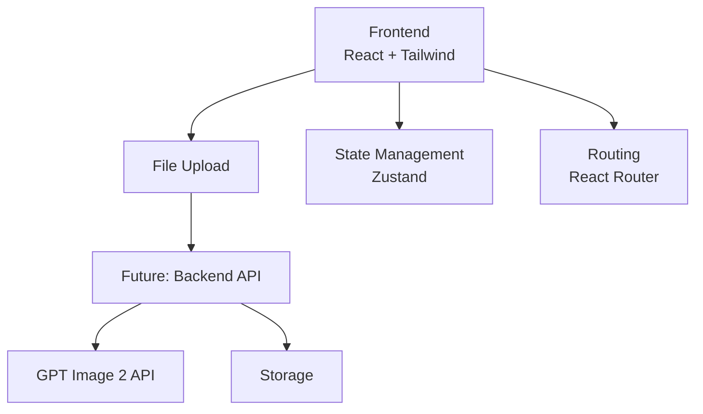

## 1. Architecture Design



## 2. Technology Description
- **Frontend**: React@18 + TypeScript + tailwindcss@3 + Vite
- **Initialization Tool**: Integrate into existing Next.js project
- **Backend**: None for MVP (will integrate later with GPT Image 2 API)
- **State Management**: Zustand for simple app state
- **Animations**: Framer Motion for smooth transitions

## 3. Route Definitions
| Route | Purpose |
|-------|---------|
| /floorplan-ai | Landing page with product introduction |
| /floorplan-ai/upload | File upload and generation page |
| /floorplan-ai/result | Result display and download page |

## 4. API Definitions (Future)
```typescript
interface GenerationRequest {
  file: File;
  productId?: string;
}

interface GenerationResponse {
  success: boolean;
  videoUrl?: string;
  status: 'pending' | 'processing' | 'completed' | 'failed';
  error?: string;
}
```

## 5. State Management

```typescript
interface AppState {
  currentStep: 'landing' | 'upload' | 'processing' | 'result';
  uploadedFile: File | null;
  previewUrl: string | null;
  generatedVideoUrl: string | null;
  isProcessing: boolean;
  progress: number;
  setStep: (step: AppState['currentStep']) => void;
  setFile: (file: File | null) => void;
  setPreviewUrl: (url: string | null) => void;
  setVideoUrl: (url: string | null) => void;
  setProcessing: (processing: boolean) => void;
  setProgress: (progress: number) => void;
  reset: () => void;
}
```

## 6. Component Structure
```
src/app/floorplan-ai/
├── page.tsx                 # Landing page
├── layout.tsx               # Layout wrapper
├── upload/
│   └── page.tsx             # Upload page
├── result/
│   └── page.tsx             # Result page
└── components/
    ├── Hero.tsx             # Hero section
    ├── Features.tsx         # Features showcase
    ├── HowItWorks.tsx       # Workflow steps
    ├── FileUploader.tsx     # Drag & drop upload
    ├── ProgressBar.tsx      # Generation progress
    ├── VideoPlayer.tsx      # Result video display
    └── CTASection.tsx       # Call to action
```
